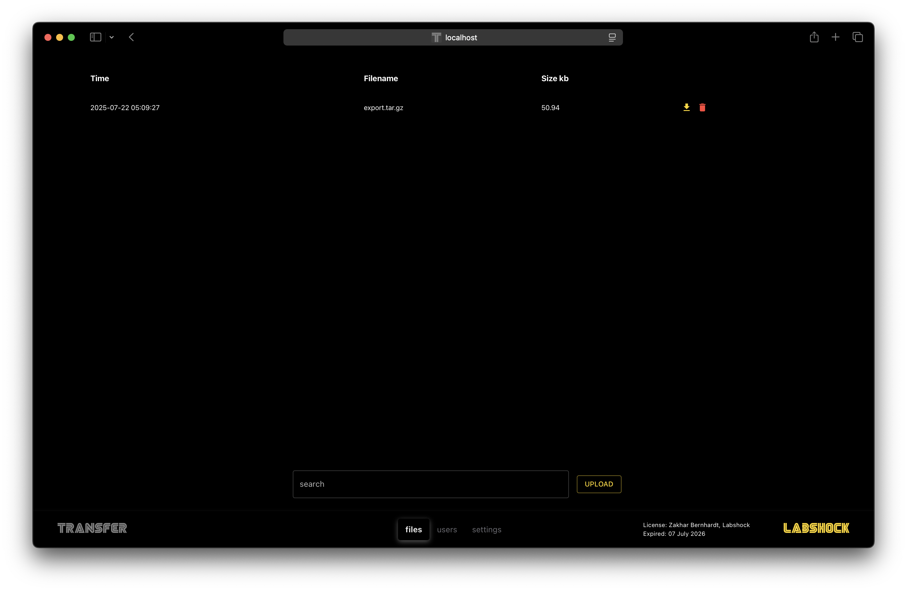

  <a href="https://github.com/zakharb/labshock">
 

    
 

> ⚠️ **Disclaimer**  
Labshock is provided strictly for **educational and training use in fully isolated environments**.  
Never use Labshock or its components against production systems or networks you do not own or have explicit permission to test.  
The author is not responsible for any misuse, data loss, or legal issues that may arise.  

 

## 🟨 #1 Industrial Cyber Lab
> A Hands-On OT Security Learning & Testing Platform

Labshock is a practical, environment-driven platform for learning and practicing Operational Technology (OT) and ICS security using real industrial components, real protocols and real telemetry.

It enables safe experimentation with industrial systems that are normally inaccessible, fragile, or safety-critical in production environments.

Labshock is not a simulator.

Labshock is a controlled OT security laboratory.

oLabshock provides a ready-to-use environment to learn, simulate and test defensive strategies.

  ⭐ please give Labshock a Star ⭐
    
 

## 🟨  World of Labshock
> Labshock evolution

World of Labshock expands Labshock from isolated environments into a connected OT security landscape with structured progression, zones & guided learning paths.

Instead of mastering a single lab, users progress through a world that reflects how OT security actually works:  
- across industries  
- across architectures  
- across maturity levels   

The World provides structure, continuity, and increasing complexity - while remaining grounded in real systems and events.

## 🟨 Key Capabilities
> why Labshock

- real industrial protocols and authentic OT traffic  
- hands-on interaction with ICS components  
- event and log generation from OT environments  
- safe execution of offensive techniques & tactics
- SIEM-focused visibility, analysis & correlation  
- progressive learning from fundamentals to advanced detection  
- repeatable, isolated & controlled lab environments  

## 🟨 Learning & Testing Philosophy
> how it works

Labshock is built around event-driven OT security understanding:
- hands-on first, theory when needed  
- focus on system behavior, not tools  
- learn from real events, not synthetic alerts  
- distinguish faults from attacks through evidence  
- build detection logic grounded in operational reality  

This approach creates skills that transfer directly to real OT environments.

   
## 🟨 Who Is It For
- OT & ICS security professionals
- Blue team & detection engineers
- Pentesters moving into OT
- Students and researchers learning industrial security
- Organizations building OT security maturity

   
## 🟨 What gives you Labshock
- build a complete OT test lab in less than 10 minutes  
- deploy a full OT/ICS cyber range with SCADA & PLC & EWS & DMZ
- capture traffic, test SIEM rules and refine IDS detection in a safe lab  
- learn OT & ICS fundamentals
- check industrial protocol behavior
- do event and telemetry collection
- log normalization and contextualization
- test detection logic design for OT systems
- write correlation of security-relevant signals
- integrate SIEM usage in industrial environments
- understand operational and safety impact
  
    
## 🟨 Requirements  
> what you need to run Labshock

Install [Docker](https://www.docker.com/), thats all.  
min: `CPU 2` | `RAM 2G` | `HDD 10G`  
max: `CPU 4` | `RAM 8G` | `HDD 20G`  

 

## 🟨 Trial License Info
> free with time limitations

Labshock is free to explore with a built-in trial mode. 
No license needed to get started.

When you run Labshock without a license, it starts in trial mode:

- 5-minute initialization delay  
- 40-minute session limit (can restart as needed)  
- unlimited restarts  

Reach out for long-term use, education, or enterprise deployments.

  
## 🟨 Install & Update

> ⚠️ Disclaimer You are running this lab at your own risk. Labshock is intended for educational and lawful testing in isolated environments only. The author is not responsible for any damage, data loss, legal issues, or misuse of this tool. Never run Labshock or its components against production systems or networks you do not own or have explicit permission to test.

Guide: [Quickstart](https://github.com/zakharb/labshock/wiki/Quickstart-Guide)  

  
## 🟨 Services

### 🔸 Portal
> heart of Labshock

The Labshock Portal is the central interface and command center for navigating the World of Labshock.

Main Portal Sections:
- track your progression from Level 1 to 60, including XP, achievements, and skills earned through hands-on actions
- theory and practical playbooks tightly connected to zones, quests, and labs
- clear objectives defining what to do next, what to focus on, and what concepts you unlock
- world map of 10 zones, each representing a new layer of OT security complexity
- your current location, showing zone-specific quests, guides, and contextual explanations
- launch and control OT labs, start and stop services, and interact with logs and traffic
- build custom lab setups to experiment freely and reproduce real-world scenarios

### 🔸 SCADA
> eyes of Labshock

SCADA supports protocols:
- Modbus RTU/TCP
- Ethernet/IP
- BACnet IP
- OPC UA
- WebAPI
- MQTT
- S7

Usage: [wiki](https://github.com/zakharb/labshock/wiki/SCADA-service)

### 🔸 PLC
> brain of Labshock
  
PLC supports all five languages defined in the IEC 61131-3 standard: 
- `LD` Ladder Logic
- `IL` Instruction List
- `ST` Structured Text
- `FBD` Function Block Diagram
- `SFC` Sequential Function Chart

Usage: [wiki](https://github.com/zakharb/labshock/wiki/PLC-service)

  
### 🔸 Pentest Fury

> offensive

⚠️ Pentest Fury includes tools for learning OT/ICS protocols and practicing defensive techniques in fully isolated Labshock labs. 
Using these tools against real networks is strictly prohibited.
Labshock’s learning station for OT/ICS protocol exploration:  

- integrated web interface
- practice protocol interactions in safe lab
- pre-installed tools for easy setup
- practice custom exercises in isolated lab
- learn different defensive techniques

Usage: [wiki](https://github.com/zakharb/labshock/wiki/Pentest-service)

> ⚠️ Disclaimer: This tool is intended for use only in the Labshock virtual environment. The developer is not responsible for any misuse or unauthorized access attempts. Using this tool against systems without explicit permission may violate local laws or regulations.

  
### 🔸 Network Swiftness

> monitoring

Labshock includes Network Swiftness for real-time network monitoring and analysis in OT environments:

- monitor live network traffic
- track active connections
- detect and classify protocols
- generate network topology maps
- capture, analyze and save packets
- web based: simple & easy

Usage: [wiki](https://github.com/zakharb/labshock/wiki/IDS-service)

  
### 🔸 Tidal Collector
> collection

Efficient OT data collection and forwarding:

- collect logs from OT devices
- normalize and forward data to SIEM
- filter and enrich data before forwarding
- lightweight and efficient
- web based: simple & easy

Usage: [wiki](https://github.com/zakharb/labshock/wiki/Collector-service)

  
### 🔸 EWS
> hands of engingeering

Engineering Station for programming SCADA and PLC:

- IDE OpenPLC Editor
- Interface to PLC
- Interface to SCADA
- Saved PLC/SCADA projects

Usage: [wiki](https://github.com/zakharb/labshock/wiki/EWS-service)

  
### 🔸 Windows

It's also possible to run `Windows` inside Labshock:
- check & use this repo [dockur/windows](https://github.com/dockur/windows)
- use at your own risk & effort

  
### 🔸 Firewall
> test and learn DMZ

Firewall service allows you to simulate and explore network segmentation in OT environments:

- simulate DMZ firewall rules 
- analyze network flows between IT/OT
- test segmentation controls
- block / allow traffic

  
### 🔸 Transfer
> test DMZ pivoting and secure file movement

Transfer service simulates typical IT/OT file transfer scenarios:

- learn OT/IT file transfer architecture
- simulate pivoting via public services
- check segmentation in controlled labs  
- observe and learn traffic flows

Usage: [wiki](https://github.com/zakharb/labshock/wiki/Transfer-service)

  

  
### 🔸 SIEM  
> integrate with your existing SIEM

Labshock can forward OT events directly into your SIEM:

- ready Splunk/ELK integration
- collectors pre-configured for quick setup
- supports log forwarding to any SIEM
- send events from OpenPLC, SCADA, IDS, and more
- real OT data for correlation and detection testing

- login to your SIEM (here is Splunk)

  
## 🟨 Use Policy

Labshock is for educational, testing and training purposes only.
  
Not allowed to use against production, third-party or real-world systems.    

  
## 🟨 License

© 2026 Labshock Security 
Labshock contains open-source and proprietary components.   
For any commercial use required Enterprise License.
Pro License is only for personal individual isage, not company.
See the [LICENSE](LICENSE) file for details.  

